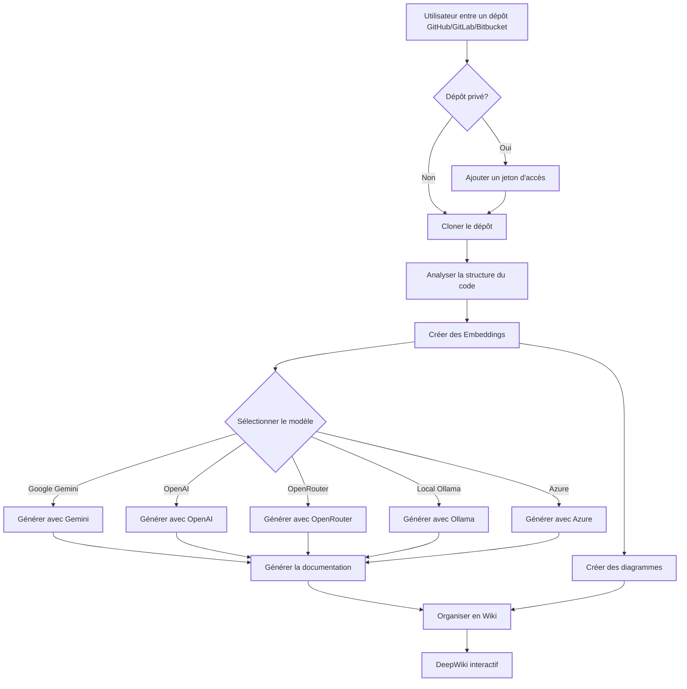

# DeepWiki-Open


**DeepWiki** est ma propre tentative d’implémentation de DeepWiki, un outil qui crée automatiquement des wikis magnifiques et interactifs pour n’importe quel dépôt GitHub, GitLab ou Bitbucket ! Il suffit d’entrer un nom de dépôt, et DeepWiki :

1. Analyse la structure du code  
2. Génère une documentation complète  
3. Crée des diagrammes visuels pour expliquer le fonctionnement  
4. Organise le tout dans un wiki facile à naviguer

[](https://buymeacoffee.com/sheing)
[](https://tip.md/sng-asyncfunc)
[](https://x.com/sashimikun_void)
[](https://discord.com/invite/VQMBGR8u5v)

[English](./README.md) | [简体中文](./README.zh.md) | [繁體中文](./README.zh-tw.md) | [日本語](./README.ja.md) | [Español](./README.es.md) | [한국어](./README.kr.md) | [Tiếng Việt](./README.vi.md) | [Português Brasileiro](./README.pt-br.md) | [Français](./README.fr.md)

## ✨ Fonctionnalités

- **Documentation instantanée** : Transforme un dépôt GitHub, GitLab ou Bitbucket en wiki en quelques secondes
- **Support des dépôts privés** : Accès sécurisé avec jetons d’accès personnels
- **Analyse intelligente** : Compréhension de la structure et des relations du code via l’IA
- **Diagrammes élégants** : Diagrammes Mermaid automatiques pour visualiser l’architecture et les flux de données
- **Navigation facile** : Interface simple et intuitive
- **Fonction “Ask”** : Posez des questions à votre dépôt avec une IA alimentée par RAG
- **DeepResearch** : Processus de recherche multi-étapes pour explorer des sujets complexes
- **Multiples fournisseurs de modèles IA** : Prise en charge de Google Gemini, OpenAI, OpenRouter, et Ollama local

## 🚀 Démarrage rapide (super facile !)

### Option 1 : Avec Docker

```bash
# Cloner le dépôt
git clone https://github.com/AsyncFuncAI/deepwiki-open.git
cd deepwiki-open

# Créer un fichier .env avec vos clés API
echo "GOOGLE_API_KEY=votre_clé_google" > .env
echo "OPENAI_API_KEY=votre_clé_openai" >> .env
# Facultatif : clé OpenRouter
echo "OPENROUTER_API_KEY=votre_clé_openrouter" >> .env
# Facultatif : hôte personnalisé Ollama
echo "OLLAMA_HOST=votre_hote_ollama" >> .env
# Facultatif : Azure OpenAI
echo "AZURE_OPENAI_API_KEY=votre_clé_azure" >> .env
echo "AZURE_OPENAI_ENDPOINT=votre_endpoint" >> .env
echo "AZURE_OPENAI_VERSION=version_api" >> .env

# Lancer avec Docker Compose
docker-compose up
```

Pour des instructions détaillées sur l’utilisation de DeepWiki avec Ollama et Docker, consultez [Ollama Instructions](Ollama-instruction.md).

> 💡 **Où obtenir ces clés :**
> - Obtenez une clé API Google depuis [Google AI Studio](https://makersuite.google.com/app/apikey)
> - Obtenez une clé API OpenAI depuis [OpenAI Platform](https://platform.openai.com/api-keys)
> - Obtenez les identifiants Azure OpenAI depuis [Azure Portal](https://portal.azure.com/) – créez une ressource Azure OpenAI et récupérez la clé API, l’endpoint et la version de l’API

### Option 2 : Installation manuelle (Recommandée)

#### Étape 1 : Configurez vos clés API

Créez un fichier `.env` à la racine du projet avec ces clés :
```
GOOGLE_API_KEY=votre_clé_google
OPENAI_API_KEY=votre_clé_openai
# Optionnel : Ajoutez ceci pour utiliser des modèles OpenRouter
OPENROUTER_API_KEY=votre_clé_openrouter
# Optionnel : Ajoutez ceci pour utiliser des modèles Azure OpenAI
AZURE_OPENAI_API_KEY=votre_clé_azure_openai
AZURE_OPENAI_ENDPOINT=votre_endpoint_azure_openai
AZURE_OPENAI_VERSION=votre_version_azure_openai
# Optionnel :Ajouter un hôte distant Ollama si il n'est pas local. défaut : http://localhost:11434
OLLAMA_HOST=votre_hote_ollama
```

#### Étape 2 : Démarrer le Backend

```bash
# Installer dépendances Python
pip install -r api/requirements.txt

# Démarrer le serveur API
python -m api.main
```

#### Étape 3 : Démarrer le Frontend

```bash
# Installer les dépendances JavaScript
npm install
# ou
yarn install

# Démarrer le serveur web
npm run dev
# ou
yarn dev
```

#### Étape 4 : Utiliser DeepWiki!

1. Ouvrir [http://localhost:3000](http://localhost:3000) dans votre navigateur
2. Entrer l'adresse d'un dépôt GitHub, GitLab ou Bitbucket (comme `https://github.com/openai/codex`, `https://github.com/microsoft/autogen`, `https://gitlab.com/gitlab-org/gitlab`, or `https://bitbucket.org/redradish/atlassian_app_versions`)
3. Pour les dépôts privés, cliquez sur "+ Ajouter un jeton d'accès" et entrez votre jeton d’accès personnel GitHub ou GitLab.
4. Cliquez sur "Générer le Wiki" et regardez la magie opérer !

## 🔍 Comment ça marche

DeepWiki utilise l'IA pour :

1. Cloner et analyser le dépôt GitHub, GitLab ou Bitbucket (y compris les dépôts privés avec authentification par jeton d'accès)
2. Créer des embeddings du code pour une récupération intelligente
3. Générer de la documentation avec une IA sensible au contexte (en utilisant les modèles Google Gemini, OpenAI, OpenRouter, Azure OpenAI ou Ollama local)
4. Créer des diagrammes visuels pour expliquer les relations du code
5. Organiser le tout dans un wiki structuré
6. Permettre des questions-réponses intelligentes avec le dépôt grâce à la fonctionnalité Ask
7. Fournir des capacités de recherche approfondie avec DeepResearch



## 🛠️ Structure du Projet

```
deepwiki/
├── api/                  # Serveur API Backend
│   ├── main.py           # Point d'entrée de l'API
│   ├── api.py            # Implémentation FastAPI
│   ├── rag.py            # Génération Augmentée par Récupération (RAG)
│   ├── data_pipeline.py  # Utilitaires de traitement des données
│   └── requirements.txt  # Dépendances Python
│
├── src/                  # Application Frontend Next.js
│   ├── app/              # Répertoire de l'application Next.js
│   │   └── page.tsx      # Page principale de l'application
│   └── components/       # Composants React
│       └── Mermaid.tsx   # Rendu des diagrammes Mermaid
│
├── public/               # Ressources statiques
├── package.json          # Dépendances JavaScript
└── .env                  # Variables d'environnement (à créer)
```

## 🤖 Système de sélection de modèles

DeepWiki implémente désormais un système de sélection de modèles flexible, qui prend en charge plusieurs fournisseurs de LLM :

### Fournisseurs et modèles pris en charge

- **Google** : Par défaut `gemini-2.0-flash`, prend également en charge `gemini-1.5-flash`, `gemini-1.0-pro`, etc.
- **OpenAI** : Par défaut `gpt-4o`, prend également en charge `o4-mini`, etc.
- **OpenRouter** : Accès à plusieurs modèles via une API unifiée, notamment Claude, Llama, Mistral, etc.
- **Azure OpenAI** : Par défaut `gpt-4o`, prend également en charge `o4-mini`, etc.
- **Ollama** : Prise en charge des modèles open source exécutés localement, tels que `llama3`.

### Variables d'environnement

Chaque fournisseur requiert les variables d'environnement de clé API correspondantes :

```
# API Keys
GOOGLE_API_KEY=votre_clé_google        # Requis pour les modèles Google Gemini
OPENAI_API_KEY=votre_clé_openai        # Requis pour les modèles OpenAI
OPENROUTER_API_KEY=votre_clé_openrouter # Requis pour les modèles OpenRouter
AZURE_OPENAI_API_KEY=votre_clé_azure_openai  #Requis pour les modèles Azure OpenAI
AZURE_OPENAI_ENDPOINT=votre_endpoint_azure_openai  #Requis pour les modèles Azure OpenAI
AZURE_OPENAI_VERSION=votre_version_azure_openai  #Requis pour les modèles Azure OpenAI

# Configuration d'un endpoint OpenAI API personnalisé
OPENAI_BASE_URL=https://custom-api-endpoint.com/v1  # Optionnel, pour les endpoints API OpenAI personnalisés

# Hôte Ollama personnalisé
OLLAMA_HOST=votre_hôte_ollama # Optionnel, si Ollama n'est pas local. défaut: http://localhost:11434

# Répertoire de configuration
DEEPWIKI_CONFIG_DIR=/chemin/vers/dossier/de/configuration  # Optionnel, pour personaliser le répertoire de stockage de la configuration
```

### Fichiers de Configuration

DeepWiki utilise des fichiers de configuration JSON pour gérer différents aspects du système :

1. **`generator.json`** : Configuration des modèles de génération de texte
   - Définit les fournisseurs de modèles disponibles (Google, OpenAI, OpenRouter, Azure, Ollama)
   - Spécifie les modèles par défaut et disponibles pour chaque fournisseur
   - Contient des paramètres spécifiques aux modèles tels que la température et top_p

2. **`embedder.json`** : Configuration des modèles d'embedding et du traitement de texte
   - Définit les modèles d'embedding pour le stockage vectoriel
   - Contient la configuration du retriever pour RAG
   - Spécifie les paramètres du séparateur de texte pour le chunking de documents

3. **`repo.json`** : Configuration de la gestion des dépôts
   - Contient des filtres de fichiers pour exclure certains fichiers et répertoires
   - Définit les limites de taille des dépôts et les règles de traitement

Par défaut, ces fichiers sont situés dans le répertoire `api/config/`. Vous pouvez personnaliser leur emplacement à l'aide de la variable d'environnement `DEEPWIKI_CONFIG_DIR`.

### Sélection de Modèles Personnalisés pour les Fournisseurs de Services

La fonctionnalité de sélection de modèles personnalisés est spécialement conçue pour les fournisseurs de services qui ont besoin de :

- Offrir plusieurs choix de modèles d'IA aux utilisateurs au sein de leur organisation
- S'adapter rapidement à l'évolution rapide du paysage des LLM sans modifications de code
- Prendre en charge des modèles spécialisés ou affinés qui ne figurent pas dans la liste prédéfinie

Les fournisseurs de services peuvent implémenter leurs offres de modèles en sélectionnant parmi les options prédéfinies ou en entrant des identifiants de modèles personnalisés dans l'interface utilisateur.

### Configuration de l'URL de base pour les canaux privés d'entreprise

La configuration `base_url` du client OpenAI est principalement conçue pour les utilisateurs d'entreprise disposant de canaux API privés. Cette fonctionnalité :

- Permet la connexion à des points de terminaison API privés ou spécifiques à l'entreprise.
- Permet aux organisations d'utiliser leurs propres services LLM auto-hébergés ou déployés sur mesure.
- Prend en charge l'intégration avec des services tiers compatibles avec l'API OpenAI.

**Bientôt disponible** : Dans les prochaines mises à jour, DeepWiki prendra en charge un mode où les utilisateurs devront fournir leurs propres clés API dans les requêtes. Cela permettra aux entreprises clientes disposant de canaux privés d'utiliser leurs accords API existants sans partager leurs informations d'identification avec le déploiement DeepWiki.

## 🧩 Utilisation de modèles d'embedding compatibles avec OpenAI (par exemple, Alibaba Qwen)

Si vous souhaitez utiliser des modèles d'embedding compatibles avec l'API OpenAI (comme Alibaba Qwen), suivez ces étapes :

1. Remplacez le contenu de `api/config/embedder.json` par celui de `api/config/embedder_openai_compatible.json`.
2. Dans votre fichier `.env` à la racine du projet, définissez les variables d'environnement appropriées, par exemple :
   ```
   OPENAI_API_KEY=votre_clé_api
   OPENAI_BASE_URL=votre_endpoint_compatible_openai
   ```
3. Le programme substituera automatiquement les espaces réservés dans `embedder.json` avec les valeurs de vos variables d'environnement.

Cela vous permet de passer facilement à n'importe quel service d'embedding compatible avec OpenAI sans modifications de code.

### Journalisation (Logging)

DeepWiki utilise le module `logging` intégré de Python pour la sortie de diagnostics. Vous pouvez configurer la verbosité et la destination du fichier journal via des variables d'environnement :

| Variable        | Description                                                               | Valeur par défaut             |
|-----------------|---------------------------------------------------------------------------|------------------------------|
| `LOG_LEVEL`     | Niveau de journalisation (DEBUG, INFO, WARNING, ERROR, CRITICAL).         | INFO                         |
| `LOG_FILE_PATH` | Chemin vers le fichier journal. Si défini, les journaux y seront écrits.  | `api/logs/application.log`   |

Pour activer la journalisation de débogage et diriger les journaux vers un fichier personnalisé :
```bash
export LOG_LEVEL=DEBUG
export LOG_FILE_PATH=./debug.log
python -m api.main
```
Ou avec Docker Compose:
```bash
LOG_LEVEL=DEBUG LOG_FILE_PATH=./debug.log docker-compose up
```

Lors de l'exécution avec Docker Compose, le répertoire `api/logs` du conteneur est lié à `./api/logs` sur votre hôte (voir la section `volumes` dans `docker-compose.yml`), ce qui garantit que les fichiers journaux persistent lors des redémarrages.

Vous pouvez également stocker ces paramètres dans votre fichier `.env` :

```bash
LOG_LEVEL=DEBUG
LOG_FILE_PATH=./debug.log
```
Puis exécutez simplement :

```bash
docker-compose up
```

**Considérations de sécurité concernant le chemin des journaux :** Dans les environnements de production, assurez-vous que le répertoire `api/logs` et tout chemin de fichier journal personnalisé sont sécurisés avec des permissions de système de fichiers et des contrôles d'accès appropriés. L'application s'assure que `LOG_FILE_PATH` se trouve dans le répertoire `api/logs` du projet afin d'empêcher le parcours de chemin ou les écritures non autorisées.

## 🛠️ Configuration Avancée

### Variables d'environnement

| Variable                | Description                                                     | Requis     | Note                                                                                                     |
|-------------------------|-----------------------------------------------------------------|------------|----------------------------------------------------------------------------------------------------------|
| `GOOGLE_API_KEY`        | Clé API Google Gemini pour la génération                        | Non        | Requis uniquement si vous souhaitez utiliser les modèles Google Gemini                                   |
| `OPENAI_API_KEY`        | Clé API OpenAI pour les embeddings et la génération              | Oui        | Remarque : Ceci est requis même si vous n'utilisez pas les modèles OpenAI, car elle est utilisée pour les embeddings. |
| `OPENROUTER_API_KEY`    | Clé API OpenRouter pour les modèles alternatifs                 | Non        | Requis uniquement si vous souhaitez utiliser les modèles OpenRouter                                      |
| `AZURE_OPENAI_API_KEY`  | Clé API Azure OpenAI                                            | Non        | Requis uniquement si vous souhaitez utiliser les modèles Azure OpenAI                                    |
| `AZURE_OPENAI_ENDPOINT` | Point de terminaison Azure OpenAI                               | Non        | Requis uniquement si vous souhaitez utiliser les modèles Azure OpenAI                                    |
| `AZURE_OPENAI_VERSION`  | Version Azure OpenAI                                            | Non        | Requis uniquement si vous souhaitez utiliser les modèles Azure OpenAI                                    |
| `OLLAMA_HOST`           | Hôte Ollama (par défaut : http://localhost:11434)               | Non        | Requis uniquement si vous souhaitez utiliser un serveur Ollama externe                                   |
| `PORT`                  | Port du serveur API (par défaut : 8001)                         | Non        | Si vous hébergez l'API et le frontend sur la même machine, assurez-vous de modifier le port de `SERVER_BASE_URL` en conséquence |
| `SERVER_BASE_URL`       | URL de base du serveur API (par défaut : http://localhost:8001) | Non        |                                                                                                           |
| `DEEPWIKI_AUTH_MODE`    | Définir sur `true` ou `1` pour activer le mode verrouillé        | Non        | La valeur par défaut est `false`. Si activé, `DEEPWIKI_AUTH_CODE` est requis.                             |
| `DEEPWIKI_AUTH_CODE`    | Le code requis pour la génération de wiki lorsque `DEEPWIKI_AUTH_MODE` est activé. | Non        | Utilisé uniquement si `DEEPWIKI_AUTH_MODE` est `true` ou `1`.                          |

Si vous n'utilisez pas le mode Ollama, vous devez configurer une clé API OpenAI pour les embeddings. Les autres clés API ne sont requises que si vous configurez et utilisez des modèles des fournisseurs correspondants.

## Mode vérouillé

DeepWiki peut être configuré pour fonctionner en mode vérouillé, où la génération de wiki nécessite un code d'autorisation valide. Ceci est utile si vous souhaitez contrôler qui peut utiliser la fonctionnalité de génération.
Restreint l'initialisation du frontend et protège la suppression du cache, mais n'empêche pas complètement la génération backend si les points de terminaison de l'API sont atteints directement.

Pour activer le mode vérouillé, définissez les variables d'environnement suivantes :

- `DEEPWIKI_AUTH_MODE` : définissez cette variable sur `true` ou `1`. Une fois activée, l'interface affichera un champ de saisie pour le code d'autorisation.
- `DEEPWIKI_AUTH_CODE` : définissez cette variable sur le code secret souhaité. Restreint l'initialisation du frontend et protège la suppression du cache, mais n'empêche pas complètement la génération backend si les points de terminaison de l'API sont atteints directement.

Si `DEEPWIKI_AUTH_MODE` n'est pas défini ou est défini sur `false` (ou toute autre valeur que `true`/`1`), la fonctionnalité d'autorisation sera désactivée et aucun code ne sera requis.

### Configuration Docker

Vous pouvez utiliser Docker pour exécuter DeepWiki :

#### Exécution du conteneur

```bash
# Récupérer l'image depuis GitHub Container Registry
docker pull ghcr.io/asyncfuncai/deepwiki-open:latest

# Exécuter le conteneur avec les variables d'environnement
docker run -p 8001:8001 -p 3000:3000 \
  -e GOOGLE_API_KEY=votre_clé_google \
  -e OPENAI_API_KEY=votre_clé_openai \
  -e OPENROUTER_API_KEY=votre_clé_openrouter \
  -e OLLAMA_HOST=votre_hôte_ollama \
  -e AZURE_OPENAI_API_KEY=votre_clé_azure_openai \
  -e AZURE_OPENAI_ENDPOINT=votre_endpoint_azure_openai \
  -e AZURE_OPENAI_VERSION=votre_version_azure_openai \

  -v ~/.adalflow:/root/.adalflow \
  ghcr.io/asyncfuncai/deepwiki-open:latest
```

Cette commande monte également `~/.adalflow` de votre hôte vers `/root/.adalflow` dans le conteneur. Ce chemin est utilisé pour stocker :
- Les dépôts clonés (`~/.adalflow/repos/`)
- Leurs embeddings et index (`~/.adalflow/databases/`)
- Le contenu wiki généré mis en cache (`~/.adalflow/wikicache/`)

Cela garantit que vos données persistent même si le conteneur est arrêté ou supprimé.

Vous pouvez également utiliser le fichier `docker-compose.yml` fourni :

```bash
# Modifiez d'abord le fichier .env avec vos clés API
docker-compose up
```

(Le fichier `docker-compose.yml` est préconfiguré pour monter `~/.adalflow` pour la persistance des données, de manière similaire à la commande `docker run` ci-dessus.)

#### Utilisation d'un fichier .env avec Docker

Vous pouvez également monter un fichier `.env` dans le conteneur :

```bash
# Créer un fichier .env avec vos clés API
echo "GOOGLE_API_KEY=votre_clé_google" > .env
echo "OPENAI_API_KEY=votre_clé_openai" >> .env
echo "OPENROUTER_API_KEY=votre_clé_openrouter" >> .env
echo "AZURE_OPENAI_API_KEY=votre_clé_azure_openai" >> .env
echo "AZURE_OPENAI_ENDPOINT=votre_endpoint_azure_openai" >> .env
echo "AZURE_OPENAI_VERSION=votre_version_azure_openai"  >> .env
echo "OLLAMA_HOST=votre_hôte_ollama" >> .env

# Run the container with the .env file mounted
docker run -p 8001:8001 -p 3000:3000 \
  -v $(pwd)/.env:/app/.env \
  -v ~/.adalflow:/root/.adalflow \
  ghcr.io/asyncfuncai/deepwiki-open:latest
```

Cette commande monte également `~/.adalflow` de votre hôte vers `/root/.adalflow` dans le conteneur. Ce chemin est utilisé pour stocker :
- Les dépôts clonés (`~/.adalflow/repos/`)
- Leurs embeddings et index (`~/.adalflow/databases/`)
- Le contenu wiki généré mis en cache (`~/.adalflow/wikicache/`)

Cela garantit que vos données persistent même si le conteneur est arrêté ou supprimé.

#### Construction de l'image Docker localement

If you want to build the Docker image locally:

```bash
# Clone the repository
git clone https://github.com/AsyncFuncAI/deepwiki-open.git
cd deepwiki-open

# Build the Docker image
docker build -t deepwiki-open .

# Run the container
docker run -p 8001:8001 -p 3000:3000 \
  -e GOOGLE_API_KEY=votre_clé_google \
  -e OPENAI_API_KEY=votre_clé_openai \
  -e OPENROUTER_API_KEY=votre_clé_openrouter \
  -e AZURE_OPENAI_API_KEY=votre_clé_azure_openai \
  -e AZURE_OPENAI_ENDPOINT=votre_endpoint_azure_openai \
  -e AZURE_OPENAI_VERSION=votre_version_azure_openai \
  -e OLLAMA_HOST=votre_hôte_ollama \
  deepwiki-open
```

#### Utilisation de certificats auto-signés dans Docker

Si vous êtes dans un environnement qui utilise des certificats auto-signés, vous pouvez les inclure dans la construction de l'image Docker :

1. Créez un répertoire pour vos certificats (le répertoire par défaut est `certs` à la racine de votre projet)
2. Copiez vos fichiers de certificats `.crt` ou `.pem` dans ce répertoire
3. Construisez l'image Docker :

```bash
# Construire avec le répertoire de certificats par défaut (certs)
docker build .

# Ou construire avec un répertoire de certificats personnalisé
docker build --build-arg CUSTOM_CERT_DIR=my-custom-certs .
```

### Détails du serveur API

Le serveur API fournit :
- Clonage et indexation des dépôts
- RAG (Retrieval Augmented Generation - Génération augmentée par récupération)
- Complétion de chat en streaming

Pour plus de détails, consultez le [README de l’API](./api/README.md).

## 🔌 Intégration OpenRouter

DeepWiki prend désormais en charge [OpenRouter](https://openrouter.ai/) en tant que fournisseur de modèles, vous donnant accès à des centaines de modèles d'IA via une seule API :

- **Options de modèles multiples** : accédez aux modèles d'OpenAI, Anthropic, Google, Meta, Mistral, et plus encore
- **Configuration simple** : ajoutez simplement votre clé API OpenRouter et sélectionnez le modèle que vous souhaitez utiliser
- **Rentabilité** : choisissez des modèles qui correspondent à votre budget et à vos besoins en termes de performances
- **Commutation facile** : basculez entre différents modèles sans modifier votre code

### Comment utiliser OpenRouter avec DeepWiki

1. **Obtenez une clé API** : inscrivez-vous sur [OpenRouter](https://openrouter.ai/) et obtenez votre clé API
2. **Ajouter à l'environnement** : ajoutez `OPENROUTER_API_KEY=votre_clé` à votre fichier `.env`
3. **Activer dans l'interface utilisateur** : cochez l'option "Utiliser l'API OpenRouter" sur la page d'accueil
4. **Sélectionnez le modèle** : choisissez parmi les modèles populaires tels que GPT-4o, Claude 3.5 Sonnet, Gemini 2.0, et plus encore

OpenRouter est particulièrement utile si vous souhaitez :

- Essayer différents modèles sans vous inscrire à plusieurs services
- Accéder à des modèles qui pourraient être restreints dans votre région
- Comparer les performances entre différents fournisseurs de modèles
- Optimiser le rapport coût/performance en fonction de vos besoins

## 🤖 Fonctionnalités Ask & DeepResearch

### Fonctionnalité Ask

La fonctionnalité Ask vous permet de discuter avec votre dépôt en utilisant la génération augmentée par récupération (RAG) :

- **Réponses sensibles au contexte** : obtenez des réponses précises basées sur le code réel de votre dépôt
- **Alimenté par RAG** : le système récupère des extraits de code pertinents pour fournir des réponses fondées
- **Streaming en temps réel** : visualisez les réponses au fur et à mesure de leur génération pour une expérience plus interactive
- **Historique des conversations** : le système conserve le contexte entre les questions pour des interactions plus cohérentes

### Fonctionnalité DeepResearch

DeepResearch fait passer l'analyse de référentiel au niveau supérieur avec un processus de recherche en plusieurs étapes :

- **Enquête approfondie** : explore en profondeur des sujets complexes grâce à de multiples itérations de recherche
- **Processus structuré** : suit un plan de recherche clair avec des mises à jour et une conclusion complète
- **Continuation automatique** : l'IA poursuit automatiquement la recherche jusqu'à ce qu'elle atteigne une conclusion (jusqu'à 5 itérations)
- **Étapes de la recherche** :
  1. **Plan de recherche** : décrit l'approche et les premières conclusions
  2. **Mises à jour de la recherche** : s'appuie sur les itérations précédentes avec de nouvelles informations
  3. **Conclusion finale** : fournit une réponse complète basée sur toutes les itérations

Pour utiliser DeepResearch, activez simplement le commutateur "Deep Research" dans l'interface Ask avant de soumettre votre question.

## 📱 Captures d'écran


*L'interface principale de DeepWiki*


*Accédez aux dépôts privés avec des jetons d'accès personnels*


*DeepResearch effectue des recherches en plusieurs étapes pour des sujets complexes*

### Vidéo de démonstration

[](https://youtu.be/zGANs8US8B4)

*Regardez DeepWiki en action !*
## ❓ Dépannage

### Problèmes de clé API

- **"Variables d'environnement manquantes"** : assurez-vous que votre fichier `.env` se trouve à la racine du projet et qu'il contient les clés API requises.
- **"Clé API non valide"** : vérifiez que vous avez correctement copié la clé complète, sans espaces supplémentaires.
- **"Erreur d'API OpenRouter"** : vérifiez que votre clé API OpenRouter est valide et qu'elle dispose de crédits suffisants.
- **"Erreur d'API Azure OpenAI"** : vérifiez que vos informations d'identification Azure OpenAI (clé API, point de terminaison et version) sont correctes et que le service est correctement déployé.

### Problèmes de connexion

- **"Impossible de se connecter au serveur API"** : assurez-vous que le serveur API est en cours d'exécution sur le port 8001.
- **"Erreur CORS"** : l'API est configurée pour autoriser toutes les origines, mais si vous rencontrez des problèmes, essayez d'exécuter le frontend et le backend sur la même machine.

### Problèmes de génération

- **"Erreur lors de la génération du wiki"** : pour les très grands référentiels, essayez d'abord un référentiel plus petit.
- **"Format de référentiel non valide"** : assurez-vous que vous utilisez un format d'URL GitHub, GitLab ou Bitbucket valide.
- **"Impossible de récupérer la structure du référentiel"** : pour les référentiels privés, assurez-vous d'avoir saisi un jeton d'accès personnel valide avec les autorisations appropriées.
- **"Erreur de rendu du diagramme"** : l'application essaiera automatiquement de corriger les diagrammes cassés.

### Solutions courantes

1. **Redémarrez les deux serveurs** : parfois, un simple redémarrage résout la plupart des problèmes.
2. **Vérifiez les journaux de la console** : ouvrez les outils de développement du navigateur pour voir les erreurs JavaScript.
3. **Vérifiez les journaux de l'API** : consultez le terminal où l'API est en cours d'exécution pour les erreurs Python.

## 🤝 Contribution

Les contributions sont les bienvenues ! N'hésitez pas à :
- Ouvrir des issues pour les bugs ou les demandes de fonctionnalités
- Soumettre des pull requests pour améliorer le code
- Partager vos commentaires et vos idées

## 📄 Licence

Projet sous licence MIT – Voir le fichier [LICENSE](LICENSE).

## ⭐ Historique des stars

[](https://star-history.com/#AsyncFuncAI/deepwiki-open&Date)


